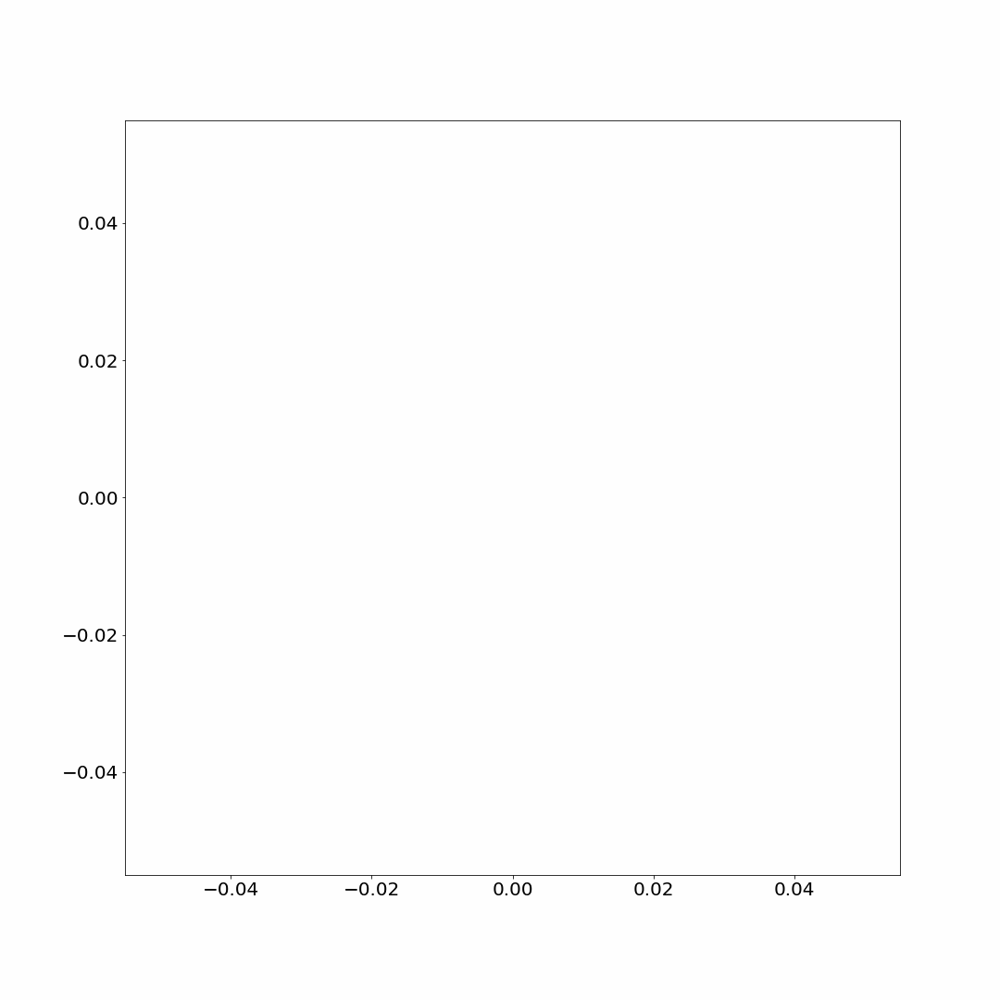

# Force Fields
Currently, the moving object is defined via a class, while the force field is defined manually while I'm playing around with the animations.

## Current progress with animation:

## Additional Animations:

